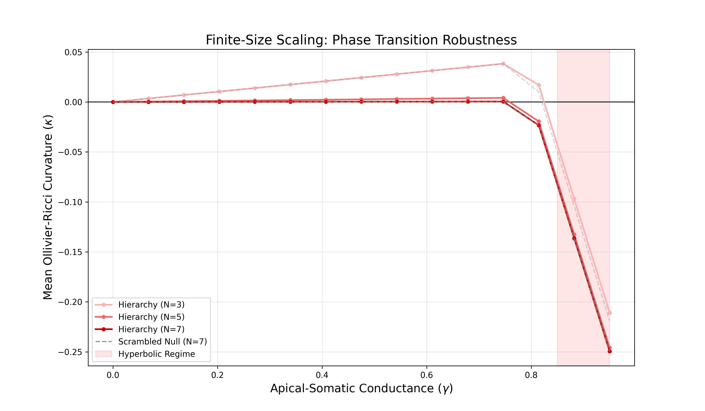

# Dendritic Curvature Adaptation (CAH)

This repository contains the simulation framework for the **Curvature Adaptation Hypothesis (CAH)**, proposing that the brain utilizes SST-interneuron mediated dendritic shunting to dynamically regulate functional manifold curvature.

## Overview
The core simulation uses **Ollivier-Ricci Curvature** and **Optimal Transport** to demonstrate a non-linear phase transition from Euclidean to Hyperbolic regimes in hierarchical neural topologies.

## Key Features
- **Hierarchical Graph Generation:** Balanced Cayley trees representing cortical hierarchies.
- **Topological Null Models:** Degree-preserving scrambled graphs via double-edge swapping.
- **Curvature Analysis:** Calculation of 1-Wasserstein distances using the Earth Mover's Distance (EMD) algorithm.

## Installation
Requires Python 3.8+ and the following libraries:
- `networkx`
- `pot` (Python Optimal Transport)
- `numpy`
- `matplotlib`

## Usage
To run the primary simulation and generate the "Spherical Bulge" vs "Flat Manifold" plots:
```bash
python run_cah_local.py
```

## Results


