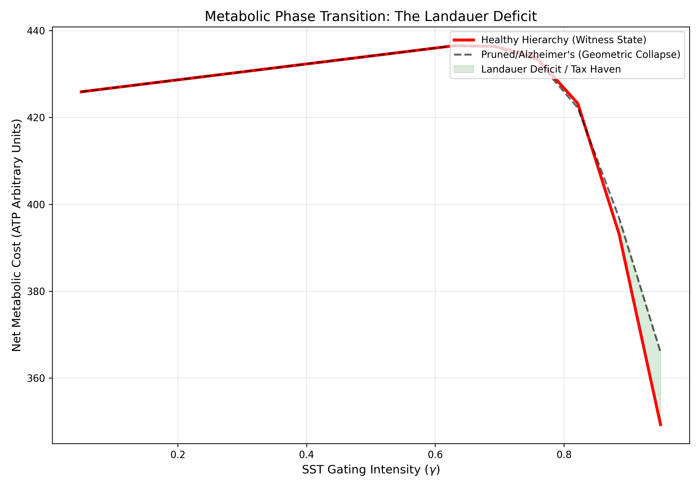
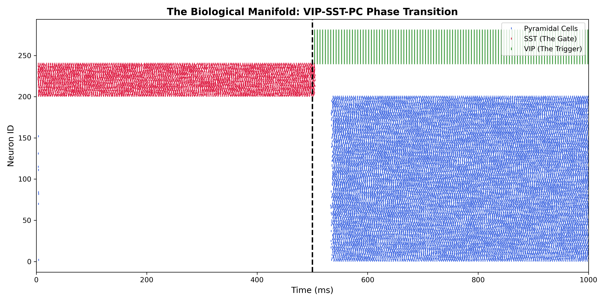

# Dynamic Curvature Adaptation

This repository contains the official simulation suite for the **Curvature Adaptation Hypothesis** (CAH), a unified theory of cortical state that bridges cellular-level dendritic gating with macroscopic functional geometry.

<figure>
        
        <figcaption>Figure 5: The Metabolic Phase Transition. Simulation reveals a 'Thermodynamic Tax Haven' (Green Zone) where healthy hierarchical networks (Red) bypass the Landauer Limit of information erasure. Pathological networks with synaptic pruning (Grey) suffer 'Geometric Collapse,' paying a higher metabolic cost for the same computational load."</figcaption>
</figure>
<br>
<br>

The Dynamic Curvature Adaptation manuscript is available here: [https://doi.org/10.5281/zenodo.18615180](https://doi.org/10.5281/zenodo.18615180)

I also used the framework from this manuscript to design a "Manifold Chip," where analog transistors act as "SST cells," dumping data to ground to save energy, or opening up to warp the chip's effective geometry into hyperbolic space exactly when the data requires it. 

The Manifold Chip manuscript is available here: 

[https://doi.org/10.5281/zenodo.18717807](https://doi.org/10.5281/zenodo.18717807)

https://github.com/MPender08/manifold-chip-architecture

## Overview

The **Curvature Adaptation Hypothesis** (CAH) proposes that the brain does not reside in a fixed geometric manifold. Instead, it dynamically "warps" its functional space to match the hierarchical depth of incoming data. We identify a plausible biophysical actuator—the Martinotti-cell subtype of Somatostatin (SST) interneurons—that regulates the apical-somatic conductance ratio (γ) to serve as a geometric switch.

By modulating this switch, the cortex can transition from a stable Euclidean regime (κ≈0) to a deep Hyperbolic regime (κ<0), unlocking a global "signaling tax haven" for efficient hierarchical inference.

<figure>
        
        <figcaption>Figure 2: Spiking Neural Network Validation: A PyNEST simulation of 280 integrate-and-fire neurons demonstrating the topological phase transition. Left (0-500ms): Heavy SST interneuron gating (red) suppresses Pyramidal cell activity (blue), locking the network in a low-energy Euclidean baseline. Right                 (500-1000ms): A step-current triggers VIP interneurons (green), which selectively shunt the SST gates. This disinhibition allows the Pyramidal network to spontaneously self-organize into highly synchronized 40Hz gamma-band pillars.
        </figcaption>
</figure>

### Key Theoretical Findings

**Topological Robustness:** The hyperbolic phase transition is driven by local synaptic density rather than global architectural order. It survives degree-preserving scrambling but collapses under synaptic loss.

**Geometric Trilogy:** We model cognitive health and disease as distinct functional states:

        Healthy: Tunable flexibility between flat and hyperbolic manifolds.

        Manic: "Geometric Inelasticity" (forced hyperbolicity) via VIP-like hub nodes.

        Neurodegenerative: "Geometric Collapse" (trapped Euclidean) via stochastic pruning.

## Installation

The script **energy_ROI_tracker.py** depends on the physics engine in **run_CAH_scaling_analysis.py**. Please ensure **both files** are downloaded to the same directory before running.

Note: The PyNEST simulation requires NEST to be installed.

```bash
git clone https://github.com/MPender08/dendritic-curvature-adaptation.git
cd dendritic-curvature-adaptation
```

This project requires Python 3.8+ and the following scientific libraries:
```bash
pip install networkx numpy matplotlib pot tqdm joblib scipy
```

### Simulation Suite


**1. Finite-Size Scaling and Robustness** (run_CAH_scaling_analysis.py)
```bash
python run_CAH_scaling_analysis.py
```

  Reproduces Figure 1 from the manuscript. It tests the scale-invariance of the phase transition across depths (N=3,5,7) and compares the hierarchy against a scrambled null model.
  Optimization: Utilizes a Sparse Neighborhood Transport algorithm to reduce computational complexity for large graphs (N=7, ~8500 nodes), ignoring zero-mass entries in the distance matrix to accelerate the OT solver.

**2. Pathological Hubs (Manic State)** (run_CAH_with_Hubs.py)
```bash
python run_CAH_with_Hubs.py
```

  Reproduces Figure 2. Introduces high-centrality "VIP-like" hub nodes to demonstrate how hyper-connectivity abolishes the Euclidean "rest" state.

**3. Synaptic Pruning (Geometric Collapse)** (run_CAH_Pruning.py)
```bash
python run_CAH_Pruning.py
```

  Reproduces Figure 3. Simulates the 30% stochastic spine loss characteristic of Alzheimer’s disease to demonstrate the loss of geometric depth.

**4. Metabolic ROI Tracker** (energy_ROI_tracker.py)
```bash
python energy_ROI_tracker.py
```

  Reproduces Figure 4. Models the metabolic trade-off between the 'tax' of maintaining SST gating and the 'profit' of hyperbolic signaling, demonstrating the 'Landauer Deficit' accessible to healthy networks but lost in pruned (Alzheimer's-like) topologies.
  

## Acknowledgments

This research was assisted by Gemini 3 Flash and Gemini 3 Pro for drafting text, generating simulation code, and structural argument analysis. AI was used as a symbolic reasoning engine to assist in mapping biophysical parameters to differential geometric formalisms.
